# Donogan And The Lonely Race Of Men

An open world raylib game!

Back to this, aiming for May 2027 for something close to the final version.

Check out the previews on itch - https://fiver-156.itch.io/donogan-light-preview

 - you will need to download the map folder from itch and place its contents in DonoganAndTheLonelyRaceOfMen/map
	- if done correctly you will see lots of folders like map/chunk_10_10/ and some images and other things directly in the map folder
		- lots of .stack files under tile_64	
	- if you have trouble trying to get setup reach out on itch

[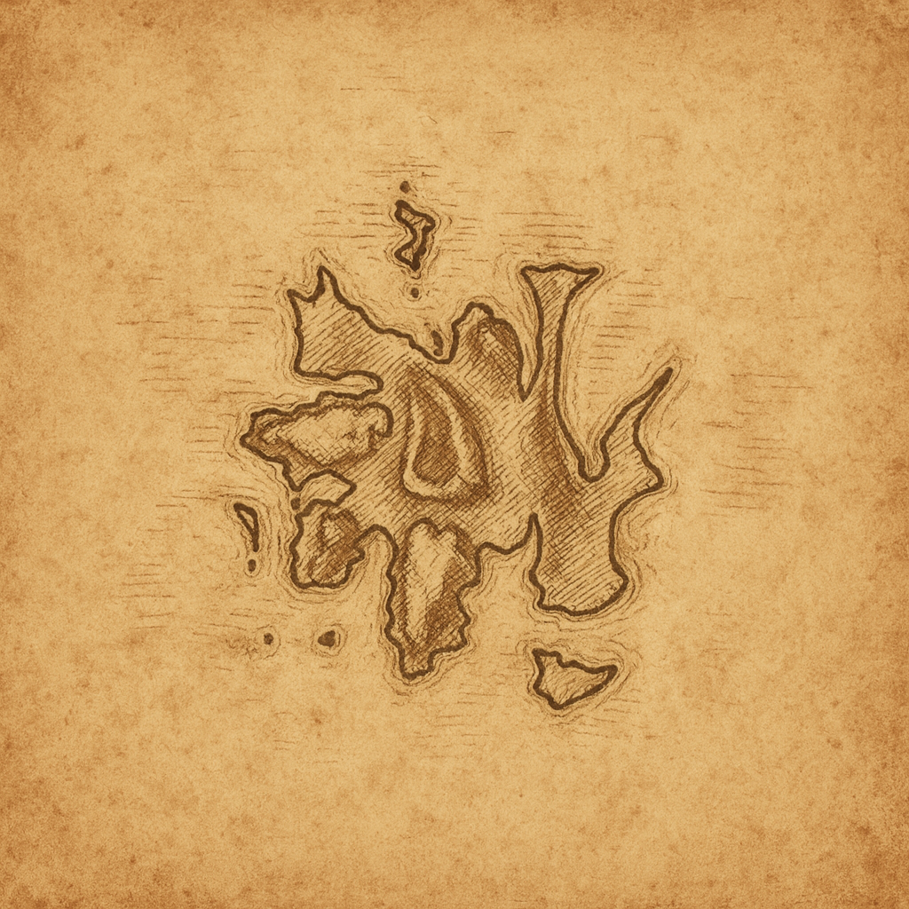](readme_assets/treasure_map.png)

[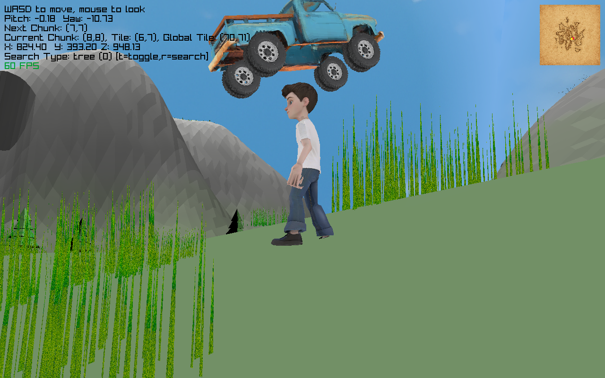](readme_assets/hellsYeah.png)

[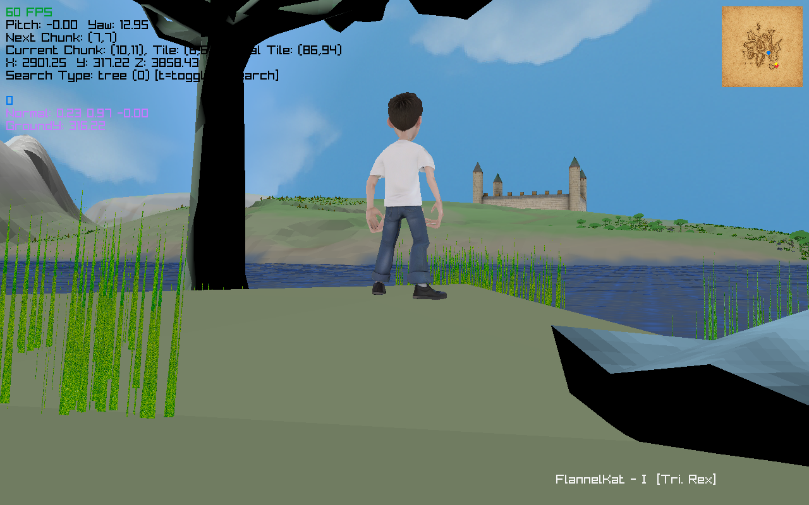](readme_assets/castle.png)

how to play...

For Donogan, you need a keyboard or a controller. The controller will need the typical "psx" buttons, so analog sticks, d-pad, start button is on the right of the middle, L&R 1,2,&3, and the 4 important buttons (like A and B and stuff, or X, Square, Circle..., that stuff). 

64 bit only. 
For now Windows only.

Controls:

control is mostly disabled on load. Once loaded, press start for the start menu.

Start Menu

Dpad up and down to select, x to punch in selection. triangle to go back.

If you want to load the existing save file, load (I have one in there for you already, give it a try if you want)

Save saves your current game (reloading is a bit jenky right now, but closing and opening seems to work consistently)

Warp lets you jump to lit fireplaces.

Options lets you change game options

Missions is just info on missions

If not in start menu, dpad controls the music. up and down for album, left and right for track. Sometimes it doesn't load, just toggle it a bit.

Donogan

x - jump

Square - freeze spell (hold it, spin fast to throw enemies, higher level equals higher effective radius)

Triangle - interact with NPC's and other things (To talk to NPC's, press triangle when near them.)

Circle - roll (use to sometimes dodge or travel a little faster on foot)

R2 (not in bow mode) - spell energy sphere

L2 - enter bow mode

R2 in bow mode fires (you can really pump out the arrows in this game, no ammo limits yet, possibly will never add them, its fun as is I think)

R1 and L1 - punch

* L1-R2 (bumpers) can be used for unlockable ariel attacks for Donogan later in the game, after completing a certain mission for each attack.

L3 - Run toggle (just punch it, dont hold it)

R3 - summon the truck

Truck

x - jump

square - break

triangle - exit and go back to Donogan (triangle again to re-enter if you are close)

circle - honk the horn. Will make Atreyu mad.

R1,L1,R2,L2 - tricks when air born. You need speed to jump high.
L3 cruise, R3 hover if unlocked

Keyboard Controls for game:

Movement: WASD
Camera / Aim: Arrow Keys

Cross / X / Confirm / Jump: Space
Square / Spell: J
Circle / Roll: K
Triangle / Interact / Exit Talk: E

L1: Q
R1: R
L2 / Bow Aim: Left Shift
R2 / Shoot: F

L3 / Run Toggle: Left Ctrl
R3 / Special / Summon / Hover Toggle: C

D-Pad Up: I
D-Pad Down: M
D-Pad Left: U
D-Pad Right: O

Start / Pause/Menu: Enter
Select: Tab

Other Helpful keyboard stuff:

F1 - full screen

F2 - dev display

F12 - take a screenshot

Z - toggle day and night

B - show boxes

V - toggle between truck mode and camera mode (Really useful if you just want to jump to the truck as donogan, but use triangle to exit)
		- if you get stuck in a building, use V to jump to the truck.

Happy adventuring! Put on some FlannelKat and drive the truck around.

[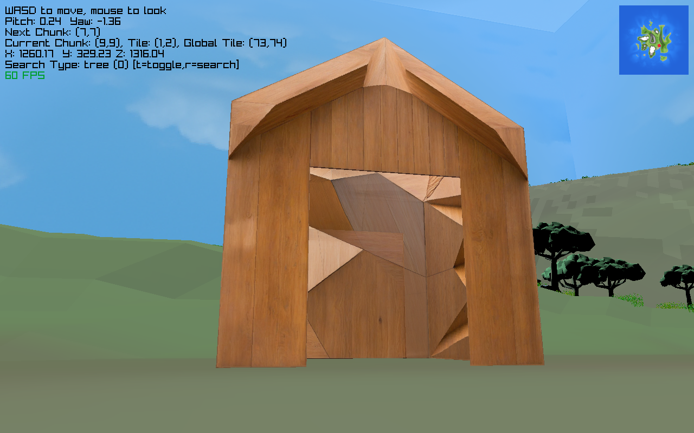](readme_assets/home1.png)

[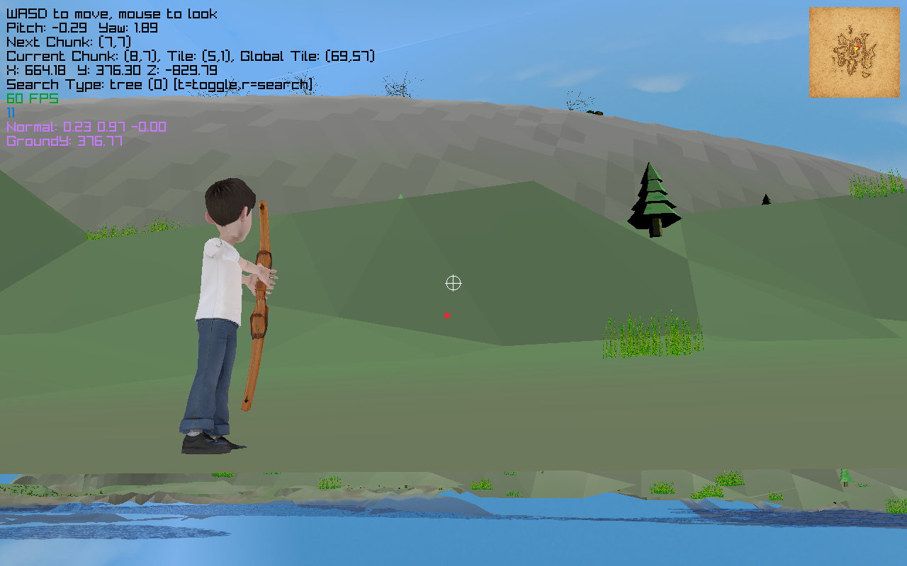](readme_assets/bowMode.png)

[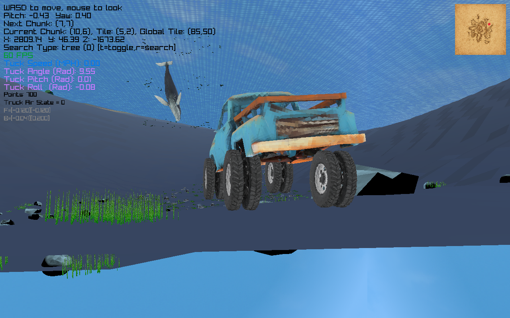](readme_assets/truck_whale_fish.png)

[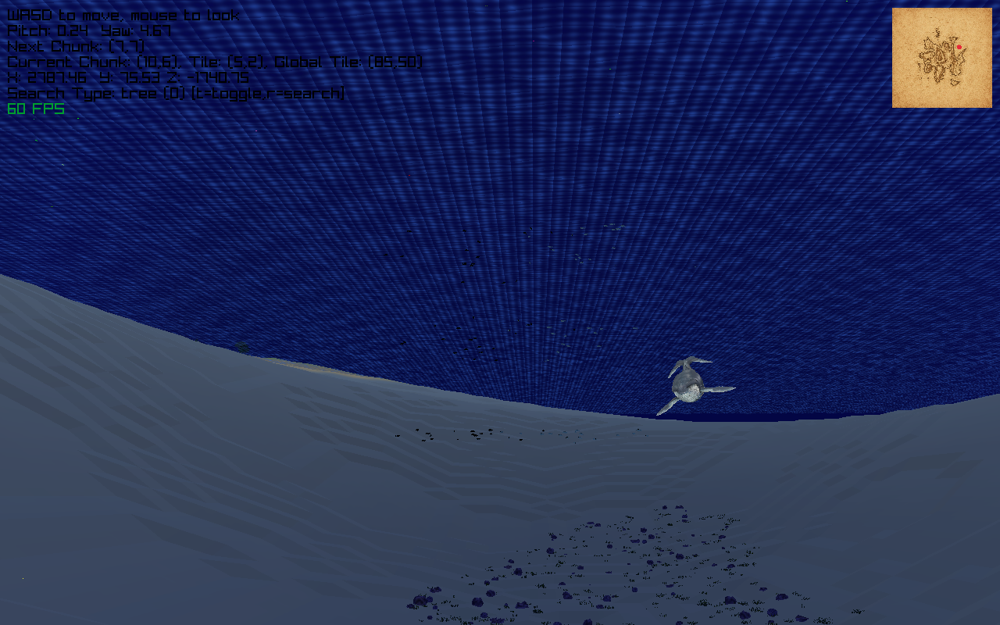](readme_assets/fish_night.png)

[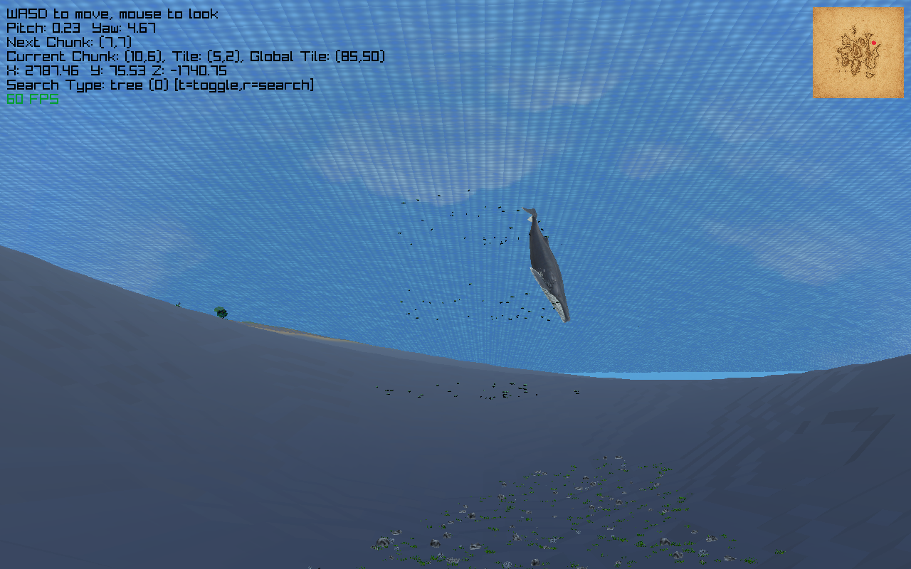](readme_assets/fish_day.png)

[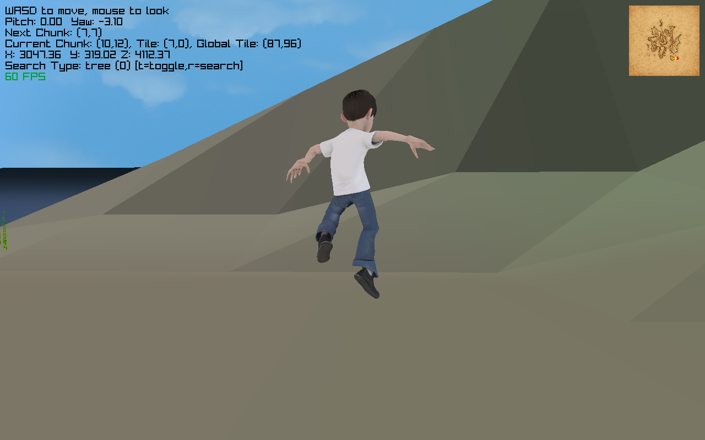](readme_assets/don_jump.png)

[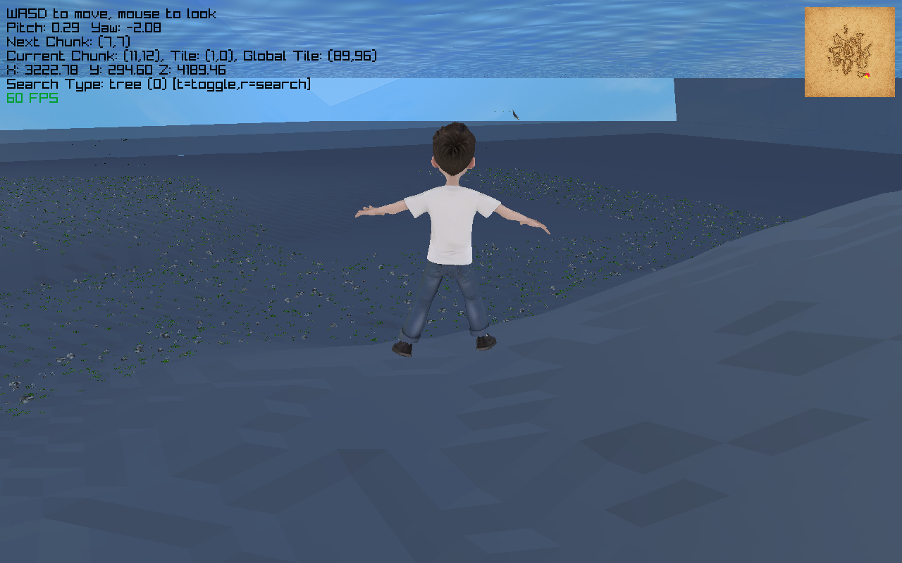](readme_assets/donnyboy.png)

[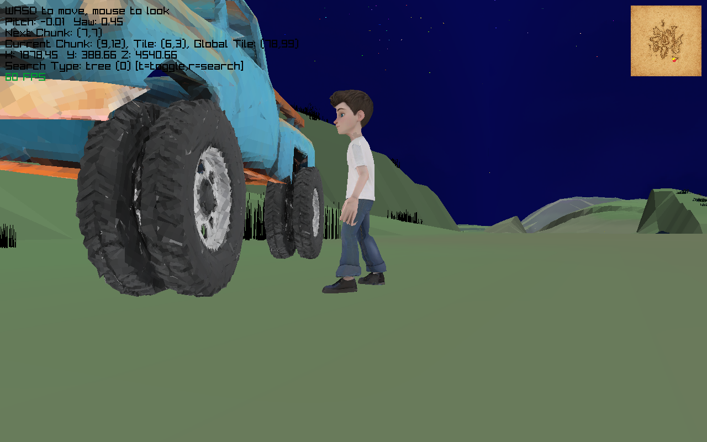](readme_assets/truckDon.png)

[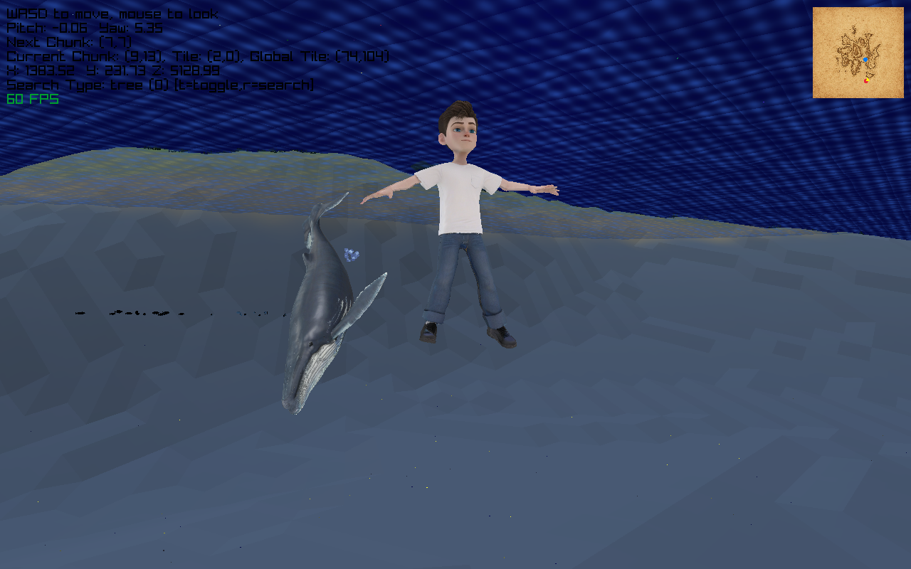](readme_assets/whaleFarts.png)

[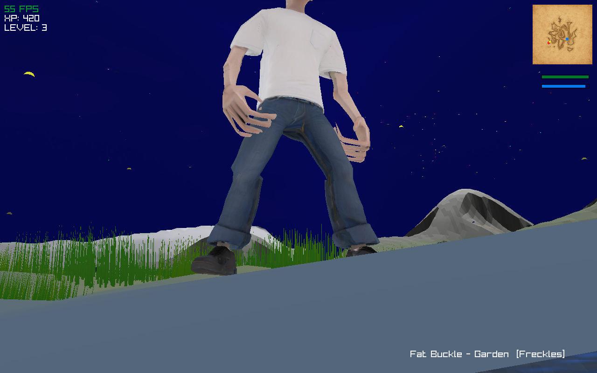](readme_assets/stars.png)

[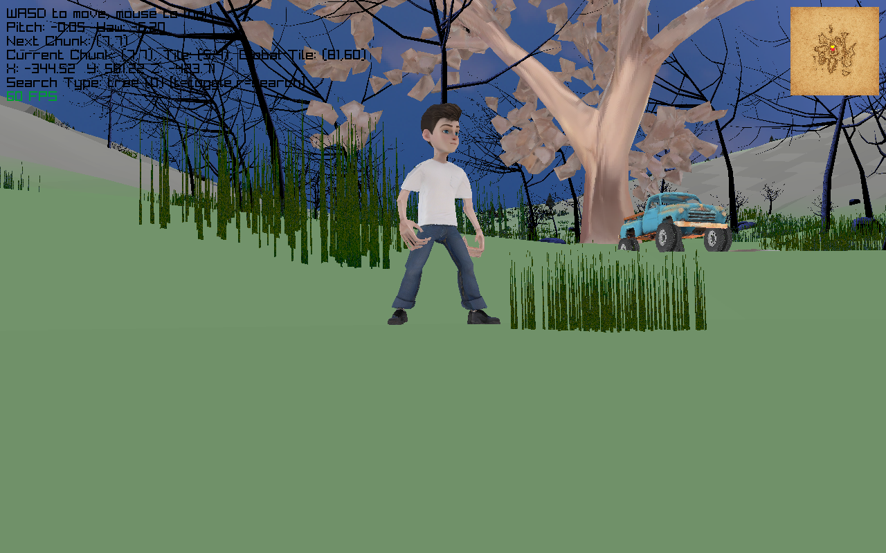](readme_assets/tol.png)

[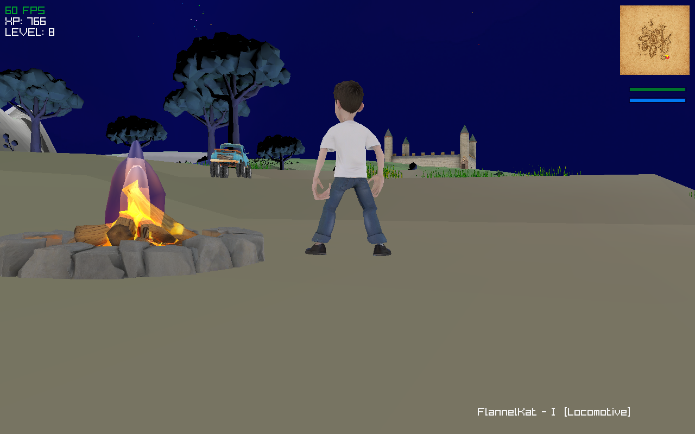](readme_assets/fire_night_1.png)

[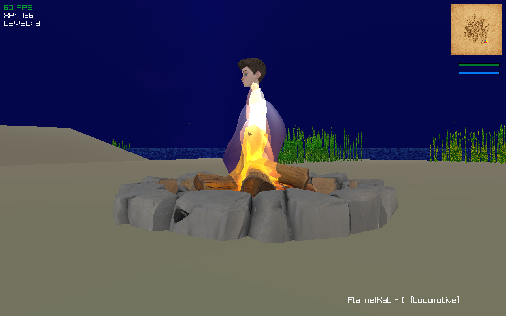](readme_assets/fire_night_2.png)

