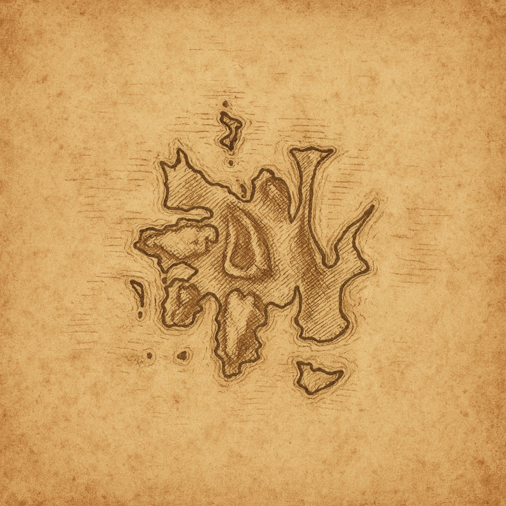
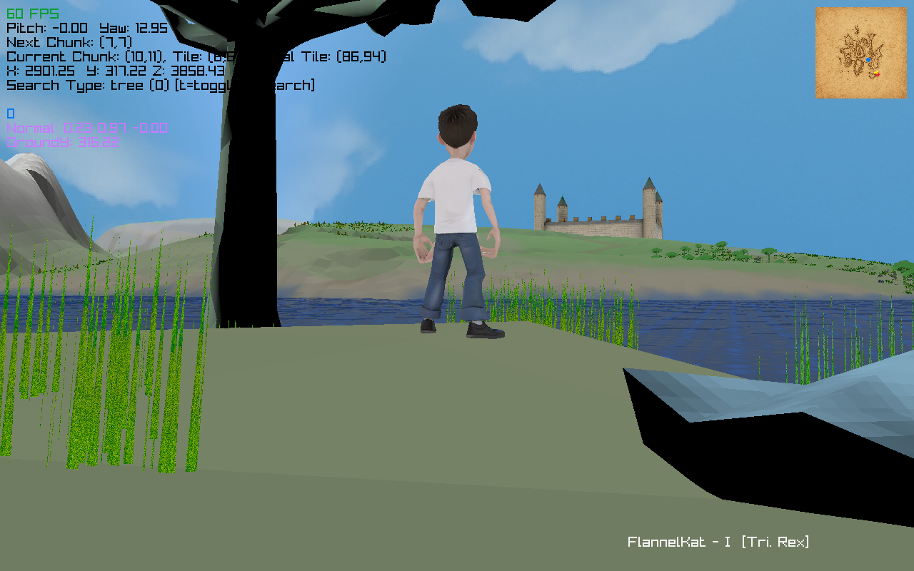
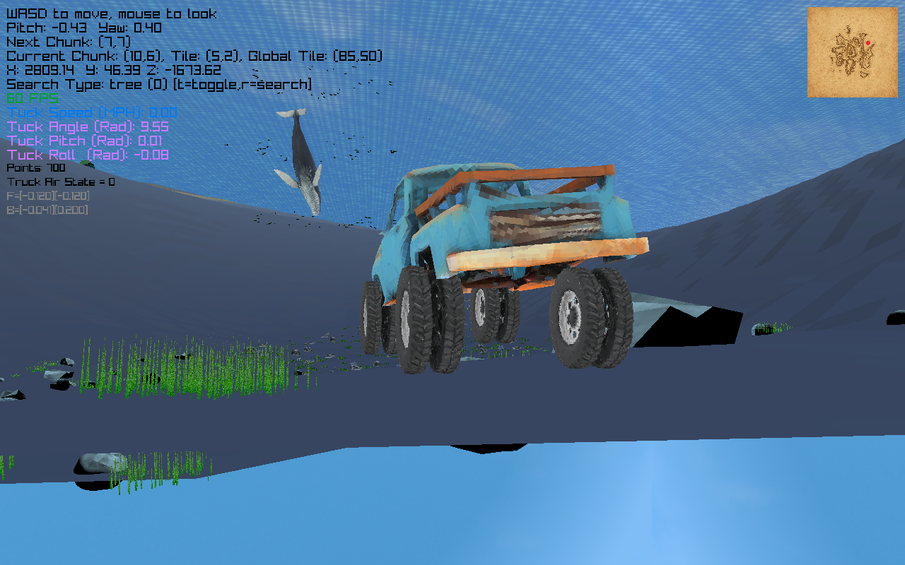
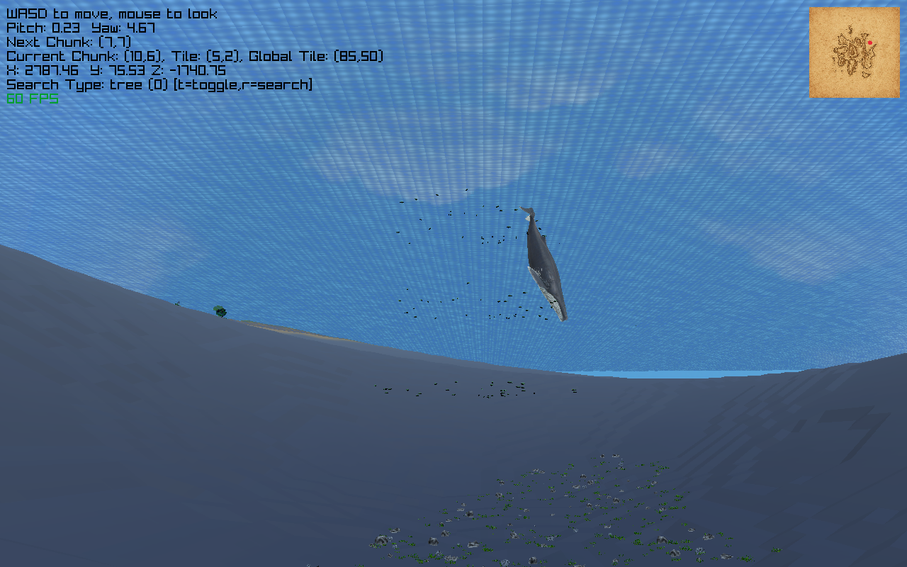

# Donogan And The Lonely Race Of Men

An open world raylib game!

Still in Active Development, right now the plan is to finish by Feb. 2026, but who knows...

Checkout the latest full version here - https://drive.google.com/file/d/1zo9r_9xbS6t6JQanSdSZKrK40O-gNuxb/view?usp=drive_link

Check out the previews on itch - https://fiver-156.itch.io/donogan-light-preview

 - you will need to download the map folder from either the light version on itch, or the google drive full version, and place its contents in DonoganAndTheLonelyRaceOfMen/map
	- if done correctly you will see lots of folders like map/chunk_10_10/ and some images and other things directly in the map folder
	- if you have trouble trying to get setup reach out on itch, (leave a comment or whatever)

how to play...

For Donogan, you need a keyboard and a controller. The controller will need the typical "psx" buttons, so analog sticks, d-pad, start button is on the right of the middle, L&R 1,2,&3. 

64 bit only. You will want a modern and decent GPU so you can run Ollama locally. (you dont have to run ollama, but the conversations are lame without it.) You probably will want 16GB RAM on your system as well.

you will probably need to install the provided c++ redistributable for some random DLL I couldn't remove from dependency. Reboot after.

On start up, the load bar is broken in this version.

Also, what makes it light weight is that I removed the tiling system for distant objects (to make the installer much smaller and the resource use lower).

 - as a result, objects will "pop" into frame as you get close to them

Controls:

control is mostly disabled on load. Once loaded, press start for the start menu.

Start Menu

Dpad up and down to select, x to punch in selection. triangle to go back.

If you want to load the existing save file, load (I have one in there for you already, give it a try if you want)

Save saves your current game (reloading is a bit jenky right now, but closing and opening seems to work consistently)

Warp lets you jump to lit fireplaces.

Options lets you change game options

Missions is just info on missions

If not in start menu, dpad controls the music. up and down for album, left and right for track. Sometimes it doesn't load, just toggle it a bit.

Donogan

x - jump

Square - freeze spell (hold it, spin fast to throw enemies, higher level equals higher effective radius)

Triangle - interact with NPC's and other things

Circle - roll (use to sometimes dodge or travel a little faster on foot)

R2 (not in bow mode) - spell energy sphere

L2 - enter bow mode

R2 in bow mode fires (you can really pump out the arrows in this game, no ammo limits yet, possibly will never add them, its fun as is I think)

R1 and L1 - punch

L3 - Run toggle (just punch it, dont hold it)

R3 - summon the truck

Truck

x - jump

square - break

triangle - exit and go back to Donogan (triangle again to re-enter if you are close)

circle - honk the horn. Will make Atreyu mad.

R1,L1,R2,L2 - tricks when air born. You need speed to jump high.

Helpful keyboard stuff

F1 - full screen

F2 - dev display

F12 - take a screenshot

Z - toggle day and night

X/C - toggle the mouse capture

V - toggle between truck mode and camera mode (Really useful if you just want to jump to the truck as donogan, but use triangle to exit)

CTRL - (Possibly Left only I cant remember...) - toggle between donogan and camera mode.

 - I cant remember if camera mode works anymore, this program started as a map builder/previewer pair. That was the way to explore the map.

 - At this point its probably not very usable.

 - if you get stuck in a building, use V to jump to the truck.

Ollama Setup (really fun to play with)

Should be as easy as installing Ollama from the website and then on the command line running "ollama run llama3", or whatever model you choose

  - "ollama run llama3" should install llama3 if you dont have it. its about 8GB I think?

  - If you need a smaller model try phi,

  - and if you want snappier shorter responses try gemma3

 - Edit ollama.config.txt if you install a different model (model name has to be correct), is on another computer or uses a different port

To talk to NPC's, press triangle when near them.

*note, the way it should really work, is to have a model trained on the game.

*you will notice the conversations are good with ollama, but as you dig...well yeah, there can be mistakes with it.

Lots of (mostly small I hope) bugs, and lots of stuff to add (inventory, more badguys. more npcs, more missions, etc)

Some things I may never fix, or will use (like the broken building collision for example, could be used to hide things in the buildings which I think is cool...)

Any way, happy adventuring. Put on some FlannelKat and drive the truck around!

