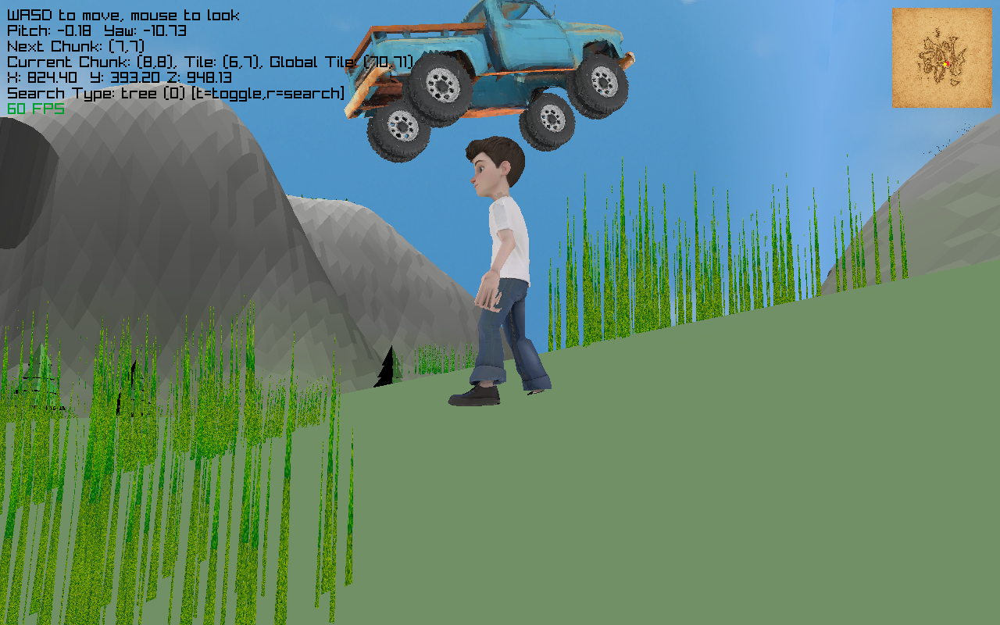

# Donogan And The Lonely Race Of Men

An open world raylib game!

Still in Active Development, right now the plan is to finish by Feb. 2026, but who knows...

Check out the previews on itch - https://fiver-156.itch.io/donogan-light-preview
 - only the light weight map is available right now
 - you will need to download the map and place its contents in DonoganAndTheLonelyRaceOfMen/map
	- if done correctly you will see lots of folders like map/chunk_10_10/ and some images and other things directly in the map folder
	- if you have trouble trying to get setup reach out on itch, (leave a comment or whatever)

